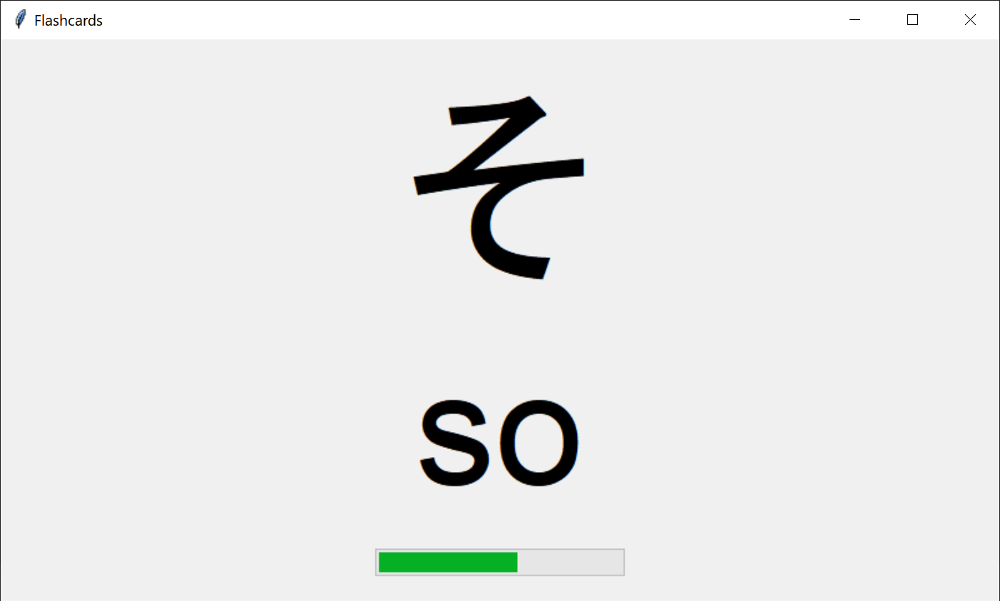

# Flashcards にほんご Characters

A simple flashcard program to help study Japanese characters. Helps users associate symbols with sounds represented by its equivalent in romaji.

Currently only supports the standard hiragana characters.

## Credits

Alex Akoopie - Creator
